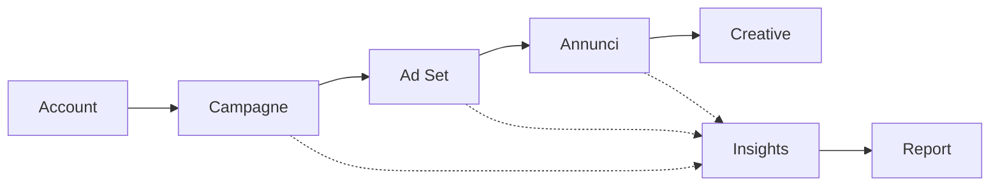

# 🚀 Meta Ads MCP Server

<div align="center">

[](https://www.python.org/downloads/)
[](https://developers.facebook.com/docs/marketing-api/)
[](https://modelcontextprotocol.io/)
[](LICENSE)

**Server MCP completo per gestire campagne pubblicitarie Facebook/Instagram**

[Quick Start](#-quick-start) • [Tools Disponibili](#-tools-disponibili) • [Configurazione](#%EF%B8%8F-configurazione) • [Esempi](#-esempi-pratici)

</div>

---

## ✨ Caratteristiche

<table>
<tr>
<td width="50%">

### 📊 **Analisi & Reporting**
- 📈 Metriche performance complete
- 🎯 Report avanzati con breakdown
- 💰 Insights su spend, ROI, ROAS
- 📅 Date personalizzate o preset

</td>
<td width="50%">

### 🎨 **Gestione Campagne**
- ✏️ Crea campagne e ad set
- 🎯 Modifica targeting e budget
- 📝 Analizza creative e annunci
- 🔄 Gestisci stato (attiva/pausa)

</td>
</tr>
</table>

### 🔥 Funzionalità Principali



- ✅ **10 Tools Completi** - Dalla creazione alla reportistica
- ✅ **System User Compatible** - Funziona con token permanenti
- ✅ **Error Handling Avanzato** - Messaggi di errore dettagliati Meta API
- ✅ **Date Flessibili** - Preset o range personalizzati (fino a 37 mesi)
- ✅ **Validazione Automatica** - Controlli Pydantic per parametri corretti

---

## ⚡ Quick Start

```bash
# 1️⃣ Clona il repository
git clone https://github.com/mikdeangelis/mcp-meta-ads.git
cd mcp-meta-ads

# 2️⃣ Crea ambiente virtuale
python3 -m venv .venv
source .venv/bin/activate  # Windows: .venv\Scripts\activate

# 3️⃣ Installa dipendenze
pip install -r requirements.txt

# 4️⃣ Configura token (vedi guida sotto)
export META_ACCESS_TOKEN="your_token_here"

# 5️⃣ Aggiungi al tuo MCP client
# Vedi sezione "Configurazione" per istruzioni specifiche
```

> 💡 **Primo utilizzo?** Segui la [guida completa per ottenere il token](#-ottenere-il-token-meta) più sotto.

---

## 🛠️ Tools Disponibili

### 📋 Gestione Risorse

| Tool | Descrizione | Esempio |
|------|-------------|---------|
| `meta_ads_list_accounts` | Lista tutti gli account pubblicitari | _"Mostrami i miei account Meta"_ |
| `meta_ads_list_campaigns` | Lista campagne di un account | _"Campagne dell'account act_123456"_ |
| `meta_ads_list_adsets` | Lista ad set di una campagna | _"Ad set della campagna 789"_ |
| `meta_ads_list_ads` | Lista annunci di un ad set | _"Annunci dell'ad set 456"_ |

### ✏️ Creazione & Modifica

| Tool | Descrizione | Parametri Chiave |
|------|-------------|------------------|
| `meta_ads_create_campaign` | Crea nuova campagna | `objective`, `daily_budget`, `special_ad_categories` |
| `meta_ads_create_adset` | Crea nuovo ad set | `targeting`, `bid_amount`, `optimization_goal` ⚠️ |
| `meta_ads_update_adset_targeting` | Modifica targeting | `age_min`, `age_max`, `genders` |
| `meta_ads_update_adset_budget` | Modifica budget | `daily_budget` |
| `meta_ads_update_adset_status` | Attiva/pausa ad set | `status` (ACTIVE/PAUSED) |

> ⚠️ **Nota**: `create_adset` richiede `bid_amount` per LINK_CLICKS e `targeting_automation.advantage_audience` (0 o 1)

### 📊 Analytics & Insights

| Tool | Descrizione | Dettagli |
|------|-------------|----------|
| `meta_ads_get_insights` | Metriche performance | Impressions, clicks, spend, CTR, CPC, conversions |
| `meta_ads_get_creative` | Dettagli creative | Testi, immagini, link, CTA |
| `meta_ads_generate_report` | Report con breakdown | Età, genere, paese, placement |

---

## 🔑 Ottenere il Token Meta

### Metodo Rapido: Graph API Explorer

<details>
<summary><b>📖 Clicca per espandere la guida passo-passo</b></summary>

#### 1️⃣ Crea App Meta Developer

1. Vai su [Facebook Developers](https://developers.facebook.com/)
2. **My Apps** → **Create App** → **Business**
3. Completa i dettagli dell'app

#### 2️⃣ Aggiungi Marketing API

1. Dashboard app → trova **Marketing API**
2. Clicca **Set Up**
3. La Marketing API apparirà nel menu

#### 3️⃣ Genera Token

**Opzione A: Graph API Explorer** (raccomandato)

1. Vai su [Graph API Explorer](https://developers.facebook.com/tools/explorer/)
2. Seleziona la tua app
3. **Get User Access Token** → Seleziona permessi:
   - ✅ `ads_management` (gestione completa)
   - ✅ `ads_read` (lettura)
   - ✅ `read_insights` (metriche)
4. **Generate Access Token** → Autorizza → Copia token

**Opzione B: System User Token** (non scade)

Per produzione, usa [System User](https://developers.facebook.com/docs/marketing-api/guides/smb/system-user-access-token-handling/) nel Business Manager.

#### 4️⃣ Converti in Long-Lived Token (60 giorni)

```bash
curl -X GET "https://graph.facebook.com/v21.0/oauth/access_token" \
  -d "grant_type=fb_exchange_token" \
  -d "client_id=YOUR_APP_ID" \
  -d "client_secret=YOUR_APP_SECRET" \
  -d "fb_exchange_token=YOUR_SHORT_LIVED_TOKEN"
```

Sostituisci:
- `YOUR_APP_ID`: Dashboard → Settings → Basic
- `YOUR_APP_SECRET`: Dashboard → Settings → Basic
- `YOUR_SHORT_LIVED_TOKEN`: Token generato al punto 3

#### 5️⃣ Verifica Token

```bash
curl "https://graph.facebook.com/v21.0/me?access_token=YOUR_TOKEN"
```

Dovresti vedere i dettagli del tuo profilo Facebook.

</details>

### Configurazione Token

**Opzione 1: File `.env` (raccomandato)**

Crea `.env` nella directory del progetto:
```bash
META_ACCESS_TOKEN=your_token_here
```

**Opzione 2: Variabile d'ambiente**

```bash
# Linux/macOS
export META_ACCESS_TOKEN="your_token_here"

# Windows PowerShell
$env:META_ACCESS_TOKEN="your_token_here"

# Persistente: aggiungi a ~/.bashrc o ~/.zshrc
echo 'export META_ACCESS_TOKEN="your_token_here"' >> ~/.bashrc
source ~/.bashrc
```

---

## ⚙️ Configurazione

### Per Claude Code

#### Metodo Automatico

```bash
claude mcp add meta-ads \
  --command "$(pwd)/.venv/bin/python" \
  --arg "$(pwd)/meta_ads_mcp.py"
```

#### Metodo Manuale

Modifica `~/.config/claude-code/config.json`:

```json
{
  "mcpServers": {
    "meta-ads": {
      "command": "/path/to/mcp-meta-ads/.venv/bin/python",
      "args": ["/path/to/mcp-meta-ads/meta_ads_mcp.py"],
      "env": {
        "META_ACCESS_TOKEN": "your_token_here"
      }
    }
  }
}
```

### Per Claude Desktop

Modifica `claude_desktop_config.json`:

**macOS/Linux:** `~/.config/Claude/claude_desktop_config.json`
**Windows:** `%APPDATA%\Claude\claude_desktop_config.json`

```json
{
  "mcpServers": {
    "meta-ads": {
      "command": "python",
      "args": ["/path/to/mcp-meta-ads/meta_ads_mcp.py"],
      "env": {
        "META_ACCESS_TOKEN": "your_token_here"
      }
    }
  }
}
```

---

## 💡 Esempi Pratici

### 🎯 Creare una Campagna Completa

```javascript
// 1. Crea campagna
meta_ads_create_campaign({
  "account_id": "act_123456789",
  "name": "Estate 2025 - Promozione",
  "objective": "OUTCOME_SALES",
  "daily_budget": 5000,  // €50/giorno
  "status": "PAUSED"
})
// ✅ Campagna creata: ID 120236574531090062

// 2. Crea ad set con targeting
meta_ads_create_adset({
  "campaign_id": "120236574531090062",
  "name": "Italia 25-55 anni",
  "optimization_goal": "LINK_CLICKS",
  "billing_event": "LINK_CLICKS",
  "bid_amount": 150,  // €1.50 per click
  "targeting": {
    "geo_locations": {"countries": ["IT"]},
    "age_min": 25,
    "age_max": 55,
    "targeting_automation": {
      "advantage_audience": 0  // ⚠️ OBBLIGATORIO
    }
  },
  "status": "PAUSED"
  // ⚠️ NON specificare daily_budget se campagna ha già budget
})
// ✅ Ad set creato: ID 120236575096660062
```

### 📊 Analisi Performance

```javascript
// Metriche ultimi 30 giorni
meta_ads_get_insights({
  "object_id": "act_123456789",
  "level": "campaign",
  "date_preset": "last_30d"
})

// Metriche con date personalizzate
meta_ads_get_insights({
  "object_id": "120236574531090062",
  "level": "campaign",
  "since": "2025-01-01",
  "until": "2025-01-31"
})

// Report breakdown per età e genere
meta_ads_generate_report({
  "object_id": "120236575096660062",
  "breakdowns": ["age", "gender"],
  "date_preset": "last_7d"
})
```

### 🎨 Analisi Creative

```javascript
// Dettagli creative di un annuncio
meta_ads_get_creative({
  "ad_id": "123456789"
})
// Restituisce: titolo, body, link, CTA, immagini/video
```

### 🔄 Gestione Stato e Budget

```javascript
// Modifica targeting
meta_ads_update_adset_targeting({
  "adset_id": "120236575096660062",
  "age_min": 30,
  "age_max": 50,
  "genders": [2]  // Solo donne
})

// Aumenta budget
meta_ads_update_adset_budget({
  "adset_id": "120236575096660062",
  "daily_budget": 3000  // €30/giorno
})

// Attiva ad set
meta_ads_update_adset_status({
  "adset_id": "120236575096660062",
  "status": "ACTIVE"
})
```

---

## 📐 Struttura Meta Ads

```
Account Pubblicitario (act_XXXXX)
│
├── 📁 Campagna (Campaign)
│   ├── 🎯 Obiettivo: OUTCOME_SALES, OUTCOME_TRAFFIC, ecc.
│   ├── 💰 Budget: Giornaliero o Lifetime
│   ├── ⏱️ Schedule: Data inizio/fine
│   │
│   └── 📦 Ad Set
│       ├── 🎯 Targeting
│       │   ├── Geo: Paesi, regioni, città
│       │   ├── Demografia: Età, genere
│       │   └── Advantage Audience: 0 o 1
│       ├── 💵 Bid Amount (per alcuni goals)
│       ├── 📊 Optimization Goal: LINK_CLICKS, CONVERSIONS, ecc.
│       │
│       └── 🎨 Annuncio (Ad)
│           └── 🖼️ Creative
│               ├── 📝 Headline & Body
│               ├── 🖼️ Immagine/Video
│               ├── 🔗 Link URL
│               └── 🎬 Call-to-Action
```

---

## ⚠️ Requisiti Importanti

### Per `meta_ads_create_adset`

| Parametro | Obbligatorio? | Note |
|-----------|---------------|------|
| `targeting.geo_locations` | ✅ Sì | Almeno paesi, regioni o città |
| `targeting.targeting_automation.advantage_audience` | ✅ Sì | 0 (disabilitato) o 1 (abilitato) |
| `bid_amount` | ⚠️ Dipende | **OBBLIGATORIO** per LINK_CLICKS, LANDING_PAGE_VIEWS, ecc. |
| `daily_budget`/`lifetime_budget` | ⚠️ Dipende | **NON usare** se campagna ha già budget |

### Budget: Regole

- ✅ **Budget solo campagna**: OK
- ✅ **Budget solo ad set**: OK (se campagna senza budget)
- ❌ **Budget campagna + budget ad set**: ERRORE (subcode 1885621)

---

## 🐛 Troubleshooting

<details>
<summary><b>❌ Errore: "META_ACCESS_TOKEN non trovato"</b></summary>

**Causa**: Variabile d'ambiente non configurata

**Soluzione**:
```bash
export META_ACCESS_TOKEN="your_token_here"
# Oppure crea file .env nella directory del progetto
```
</details>

<details>
<summary><b>❌ Errore: "Token non valido o scaduto"</b></summary>

**Causa**: Token scaduto (short-lived durano poche ore)

**Soluzione**:
1. Genera nuovo token da Graph API Explorer
2. Converti in long-lived (60 giorni)
3. Oppure usa System User token (permanente)
</details>

<details>
<summary><b>❌ Errore: "Permessi insufficienti"</b></summary>

**Causa**: Token senza permessi necessari

**Soluzione**: Rigenera token includendo:
- `ads_management` (gestione completa)
- `ads_read` (minimo per lettura)
- `read_insights` (per metriche)
</details>

<details>
<summary><b>❌ Errore: "Invalid parameter (subcode 1815857)"</b></summary>

**Causa**: Manca `bid_amount` per LINK_CLICKS

**Soluzione**: Aggiungi `bid_amount` in centesimi (es. 100 = €1.00)
</details>

<details>
<summary><b>❌ Errore: "Cannot set budget (subcode 1885621)"</b></summary>

**Causa**: Campagna ha già budget, non puoi specificarlo anche nell'ad set

**Soluzione**: Ometti `daily_budget`/`lifetime_budget` dall'ad set
</details>

<details>
<summary><b>❌ Errore: "Advantage audience required (subcode 1870227)"</b></summary>

**Causa**: Manca `targeting_automation.advantage_audience`

**Soluzione**: Aggiungi al targeting:
```json
"targeting_automation": {
  "advantage_audience": 0  // o 1
}
```
</details>

<details>
<summary><b>❌ Errore: "Rate limit raggiunto (429)"</b></summary>

**Causa**: Troppe richieste API in poco tempo

**Soluzione**: Attendi 5-10 minuti prima di riprovare
</details>

---

## 📚 Risorse Utili

- 📖 [Meta Marketing API Documentation](https://developers.facebook.com/docs/marketing-api/)
- 🧪 [Graph API Explorer](https://developers.facebook.com/tools/explorer/)
- 🔍 [API Error Reference](https://developers.facebook.com/docs/marketing-api/error-reference/)
- 💼 [Meta Business Help Center](https://www.facebook.com/business/help)
- 📊 [Insights API Reference](https://developers.facebook.com/docs/marketing-api/insights/)
- 🤖 [Model Context Protocol](https://modelcontextprotocol.io/)

---

## 🤝 Contributi

Contributi, issues e feature requests sono benvenuti!

1. Fork del progetto
2. Crea il tuo feature branch (`git checkout -b feature/AmazingFeature`)
3. Commit delle modifiche (`git commit -m 'Add some AmazingFeature'`)
4. Push al branch (`git push origin feature/AmazingFeature`)
5. Apri una Pull Request

---

## 📄 Licenza

Questo progetto è rilasciato sotto licenza **MIT**. Vedi il file [LICENSE](LICENSE) per i dettagli.

---

## 🙏 Riconoscimenti

- Basato su [Meta Marketing API v21.0](https://developers.facebook.com/docs/marketing-api/)
- Costruito con [FastMCP](https://github.com/modelcontextprotocol/python-sdk)
- Validazione con [Pydantic v2](https://docs.pydantic.dev/)

---

<div align="center">

⭐ Se questo progetto ti è utile, lascia una stella su GitHub!

</div>
